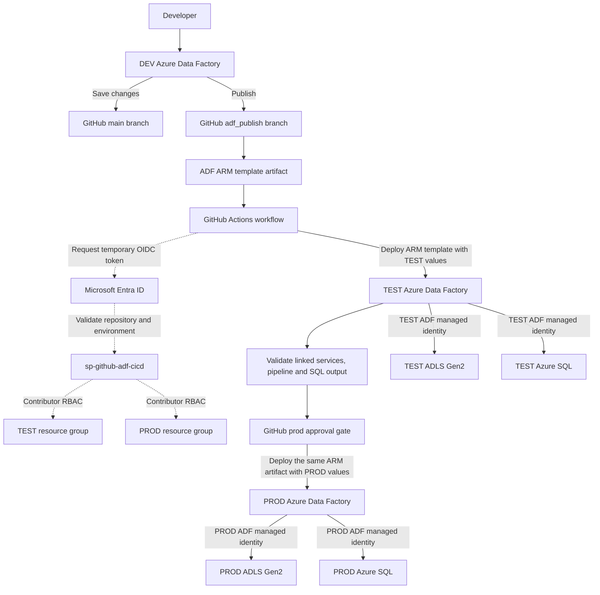

# Azure Data Factory Multi-Environment CI/CD

This project demonstrates how Azure Data Factory resources can be developed in DEV, tested in TEST and promoted to PROD through GitHub Actions.

The solution uses ARM templates, environment-specific configuration, Microsoft Entra ID, OpenID Connect, Azure RBAC and system-assigned managed identities.

## Architecture



## Environment Design

| Environment | Resource Group | Data Factory |
|---|---|---|
| DEV | `rg-adf-cicd-dev` | `adf-vk-cicd-dev-01` |
| TEST | `rg-adf-cicd-test` | `adf-vk-cicd-test-01` |
| PROD | `rg-adf-cicd-prod` | `adf-vk-cicd-prod-01` |

Each environment has a separate Data Factory, ADLS Gen2 storage account and Azure SQL Database.

## ADF Components

- Pipeline: `PL_Load_Customer_Staging`
- Source dataset: `DS_ADLS_Customers_CSV`
- Sink dataset: `DS_AzureSQL_Customer_Staging`
- ADLS linked service: `LS_ADLS_CICD`
- Azure SQL linked service: `LS_AZSQL_CICD`
- Target table: `dbo.customer_staging`

The pipeline reads a customer CSV file from ADLS Gen2 and loads the records into Azure SQL Database.

## Environment-Specific Configuration

ADF global parameters provide values for:

- Environment name
- ADLS container
- Landing folder
- Customer filename
- Target schema
- Target table

GitHub environment variables provide the correct resource group, factory name, ADLS URL, SQL server and SQL database for TEST and PROD.

## CI/CD Deployment Flow

1. Development work is completed in the DEV Data Factory.
2. ADF source-controlled resources are stored in the GitHub `main` branch.
3. Publishing the DEV factory generates ARM templates in the `adf_publish` branch.
4. The GitHub Actions workflow reads the published ARM template.
5. GitHub authenticates to Azure using a temporary OIDC token.
6. The ARM template is deployed to TEST with TEST-specific values.
7. TEST linked services, pipeline execution and SQL output are validated.
8. The workflow waits at the GitHub `prod` approval gate.
9. After approval, the same ARM artifact is deployed to PROD with PROD-specific values.
10. The PROD pipeline is executed and its SQL output is verified.

## Authentication and Authorization

### GitHub deployment identity

GitHub Actions uses the Microsoft Entra application `sp-github-adf-cicd`.

OpenID Connect allows GitHub to obtain a short-lived Azure token without storing an Azure password or client secret.

Federated credentials restrict token use to this GitHub repository and its `test` and `prod` environments.

The service principal has Contributor access only to the TEST and PROD resource groups. It deploys or updates ADF resources but does not process pipeline data.

### ADF runtime identities

Every Data Factory has its own system-assigned managed identity.

- The TEST ADF managed identity accesses TEST ADLS and TEST Azure SQL.
- The PROD ADF managed identity accesses PROD ADLS and PROD Azure SQL.

The ADF identities are separate from the GitHub deployment identity.

## GitHub Actions Workflow

The deployment workflow is stored at:

```text
.github/workflows/adf-promote.yml
```

It performs the following operations:

- Checks out the ARM template from `adf_publish`
- Authenticates to Azure using OIDC
- Applies environment-specific parameters
- Deploys to TEST
- Waits for PROD approval
- Deploys the same artifact to PROD

## Repository Structure

```text
.github/workflows/
  adf-promote.yml

dataset/
  DS_ADLS_Customers_CSV.json
  DS_AzureSQL_Customer_Staging.json

factory/
  adf-vk-cicd-dev-01.json

linkedService/
  LS_ADLS_CICD.json
  LS_AZSQL_CICD.json

pipeline/
  PL_Load_Customer_Staging.json

publish_config.json
README.md
```

The generated ARM templates are stored in the `adf_publish` branch.

## Validation Performed

- TEST and PROD ARM deployments completed successfully.
- Environment-specific linked-service endpoints were verified.
- TEST and PROD pipelines ran successfully.
- Data was verified in `dbo.customer_staging`.
- The PROD deployment required manual approval.
- No Azure client secret was stored in GitHub.

## Problems Resolved

- Corrected the ARM-template path in the GitHub Actions workflow.
- Corrected the GitHub `prod` and workflow environment-name mismatch.
- Configured OIDC federated credentials for TEST and PROD.
- Granted Contributor access to the deployment service principal.
- Configured Microsoft Entra authentication on the PROD SQL logical server.
- Created the PROD ADF managed-identity user inside Azure SQL.
- Granted database read and write roles to the ADF managed identity.

## Technologies Used

- Azure Data Factory
- Azure Data Lake Storage Gen2
- Azure SQL Database
- Microsoft Entra ID
- System-assigned managed identity
- Azure Resource Manager templates
- GitHub Actions
- OpenID Connect
- Azure RBAC

## Result

The project provides a secure and repeatable deployment process for promoting one tested ADF artifact from DEV to TEST and then to PROD without manually downloading and uploading ARM templates.
